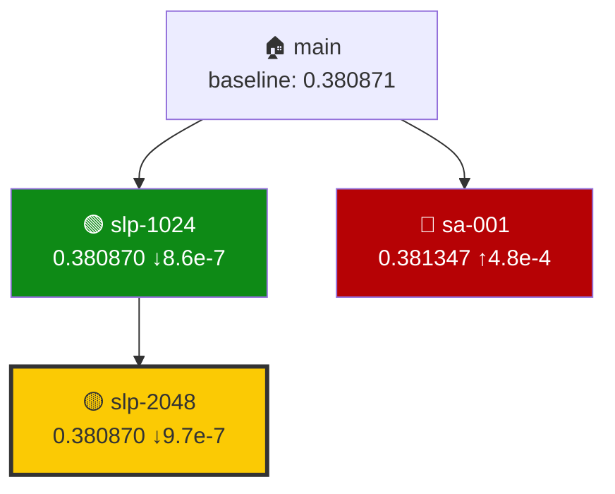

# Visualization Guide

When generating search visualizations, follow these instructions. Read `research/style.md` for base plotting style.

## Search Tree

Show the provenance graph of all orbits:

- Each orbit is a node. Connect parent → child with edges.
- X-axis: depth (generations from main). Roots at depth 0, children at depth 1, etc.
- Node color by status vs baseline:
  - Green: metric beats baseline
  - Red: dead-end (worse than baseline, no useful insight)
  - Yellow: evaluated but status unclear
  - Blue: still running / in-progress
  - Light gray: no metric yet
- Gold border on the best node
- Label each node with: orbit name, metric value, delta from baseline (e.g., "↓1.4e-7" for beating baseline, "↑4.8e-4" for worse)
- Show baseline value in the title
- Use constrained_layout for clean spacing
- If many nodes (>10), consider reducing label font size

## Leaderboard

Vertical bar chart comparing all scored orbits:

- X-axis: orbit names (sorted by metric, best on the left for minimize)
- Y-axis: metric value, zoomed to the relevant range (NOT starting from 0)
- Baseline as a horizontal dashed red line with label
- Bar color by status: gold=best/winner, green=beats baseline, red=dead-end, blue=other
- Annotate each bar with the exact metric value at the top
- If target is known, show it as a second horizontal line
- Rotate x-axis labels 45° if names are long
- Add a second subplot below showing delta from baseline (positive up = worse for minimize, negative down = better)

## Data Sources

Read orbit data from:
1. `log.md` frontmatter in each orbit's worktree (`orbits/{name}/log.md`)
2. `.re/state/campaign.json` for campaign metadata
3. `research/eval/config.yaml` for metric name, direction, target/baseline (check sanity_checks for "known best" entry if no explicit target field)

## Mermaid Search Tree (for GitHub Issues)

In addition to PNG plots, generate a Mermaid diagram for embedding in GitHub Issues and markdown. Mermaid renders natively on GitHub — no image hosting needed.

Node colors:
- 🟢 Green (`fill:#0E8A16`): beats baseline
- 🔴 Red (`fill:#B60205`): dead-end
- 🟡 Yellow (`fill:#FBCA04`): winner / best result
- 🔵 Blue (`fill:#0075CA`): in progress
- ⚪ Gray (`fill:#C5DEF5`): no metric yet

Include the Mermaid diagram in:
- Campaign Issue leaderboard comments (every 3 orbits)
- Cross-orbit review comments
- docs/index.md for GitHub Pages

## Output

- Save plots to `docs/assets/` as PNG at 150 DPI
- Generate both search_tree.png and leaderboard.png
- Generate Mermaid diagram as text (for Issue comments)
- Print a text summary alongside the plots
